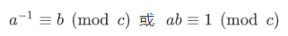
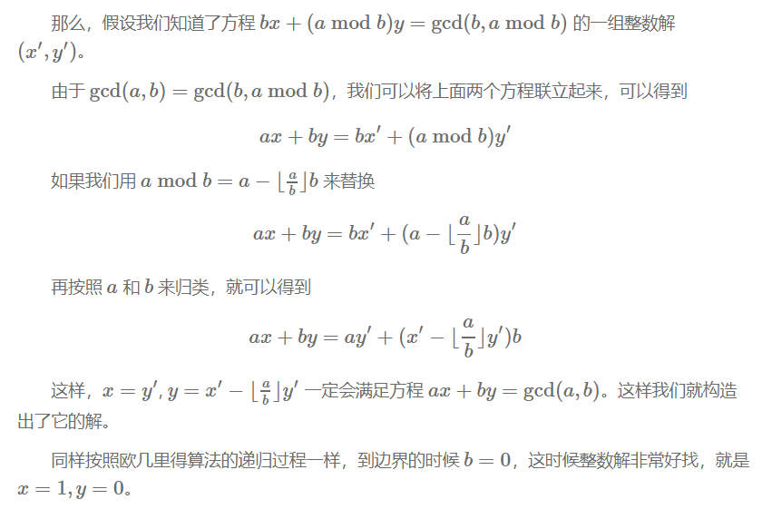
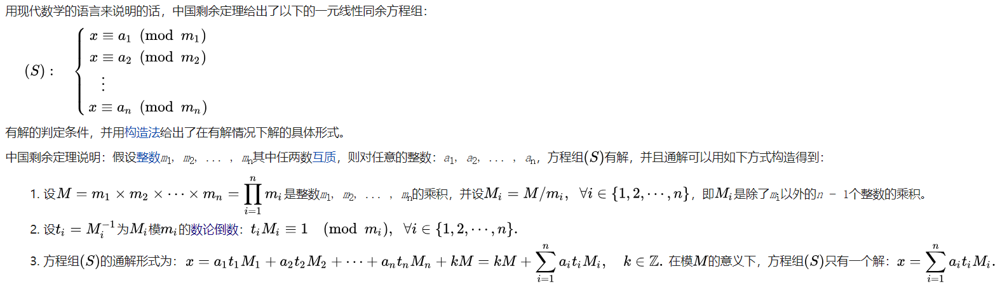
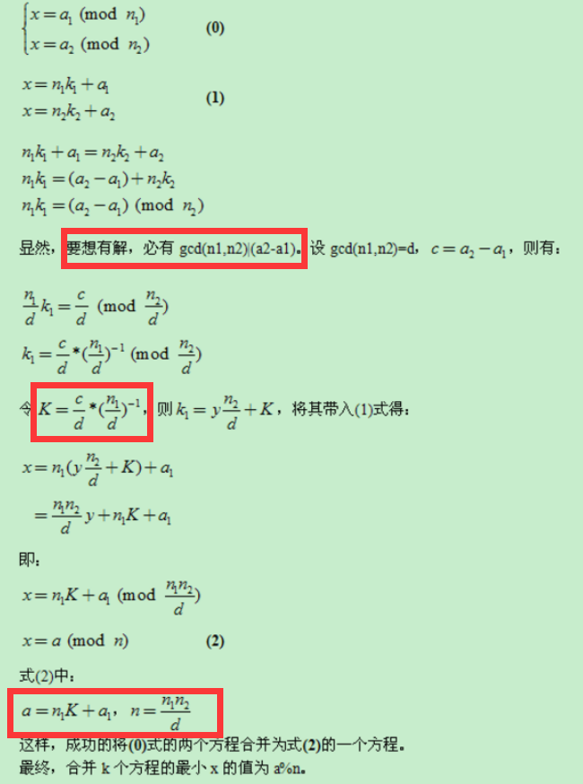
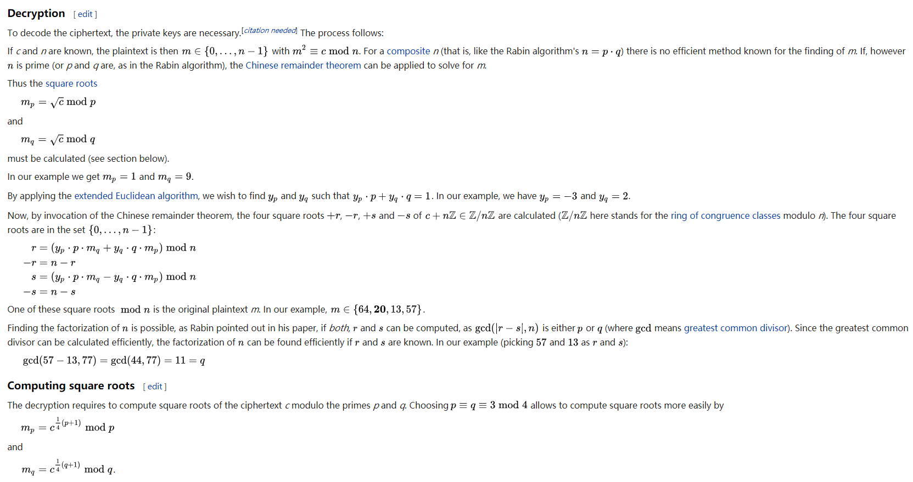
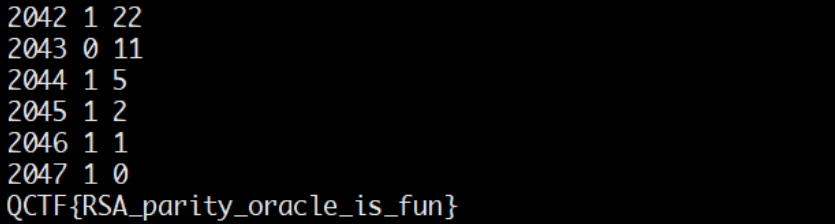

# CTF中常见的RSA相关问题总结

# 前言

​理解基本概念后，代码就可以说明一切，所以本文将每种攻击方式的实现方法都提炼成了一个函数，在理解原理时会有帮助，在需要时也可以直接调用。

# 基础

## RSA概要  

在开始前可以通过 [《RSA算法详解》](http://www.guideep.com/read?guide=5676830073815040) 这篇文章了解关于RSA的基础知识，包括加解密方法，算法原理和可行性证明等。

## 应用流程

1. 选取两个较大的互不相等的质数p和q，计算`n = p * q` 。
2. 计算`phi = (p-1) * (q-1)` 。
3. 选取任意e，使得e满足 `1<e<phi` 且 `gcd(e , phi) == 1` 。
4. 计算e关于n的模逆元d， 即d满足`(e * d)% n ==1`  。
5. 加解密：`c = (m ^ e) % n` ， `m = (c ^ d) % n` 。其中m为明文，c为密文，(n,e)为公钥对，d为私钥，要求 `0 <= m < n` 。

## 理解模逆运算

- 如果` (a*b)%c==1` ，那么a和b互为对方模c的模逆元/数论倒数，也写作 。
- 关于最大公约数有一个基本事实：`给予两整数a、c，必存在整数x、y使得ax + cy = gcd(a,c)`  ，基于这个事实，当a,c互素即`gcd(a,c)==1` 时，有`ax+cy=1` ，那么就有`(a*x)%c==1` ，所以x就是a 对c的模逆元。因此，a对c存在模逆元b的充要条件是`gcd(a,c)==1` 。显然对于每一组`a,c` ，存在一族满足条件的x，在求模逆元时我们取得是最小正整数解`x mod n` 。
- 上述的基本事实很容易理解，因为a和c的最大公约数是gcd(a,b)，所以a和c都可表示为gcd(a,b)的整数倍，那么a和b的任意整系数的线性组合ax+by也必定能表示成gcd(a,c)的整数倍，他们当中最小的正整数就应该是gcd(a,c)。实际上最大公约数有一个定义就是：`a和b的最大公约数g是a和b的线性和中的最小正整数 `  。


  - 求模逆元主要基于扩展欧几里得算法，贴一个Python实现：

    ```python
     def egcd ( a , b ):
         if (b == 0):
             return 1, 0, a
         else:
             x , y , q = egcd( b , a % b ) # q = GCD(a, b) = GCD(b, a%b)
             x , y = y, ( x - (a // b) * y )
             return x, y, q 
    def mod_inv(a,b):
        return egcd(a,b)[0]%b #求a模b得逆元
    ```

- 求模逆也可直接利用gmpy2库。如 `import gmpy2;print gmpy2.invert(47,30)` 可求得47模30的逆为23。
## 模意义下的运算法则

```c
(a + b) % n ≡ (a % n + b % n) % n
(a - b) % n ≡ (a % n - b % n) % n
(a * b) % n ≡ (a % n * b % n) % n
(a ^ b) % n ≡ ((a % n) ^ b) % n //幂运算

若 a ≡ b(mod n) ,则
1.对于任意正整数c,有a^c ≡ b^c(mod n)
2.对于任意整数c,有ac ≡ bc(mod n),a+c ≡ b+c(mod n),
3.若 c ≡ d(mod n),则a-c ≡ b-d(mod n),a+c ≡ b+d(mod n),ac ≡ bd(mod n)

如果ac≡bc (mod m)，且c和m互质，则a≡b (mod m）。
[理解：当且仅当c和m互质,c^-1存在,等式左右可同乘模逆。]

除法规则：
在模n意义下，a/b不再仅仅代表这两个数相除，而是指 a+k1*n 和 b+k2*n这两个组数中任意两个相除，使商为整数
因此也就可以理解，除以一个数等价于乘以它的逆
a/b ≡ c(mod n) <=> a ≡ c*(b^-1) (mod n)，其中b模n的逆记作b的负一次方。

费马小定理:
a是整数,p是质数,则a^p==a(mod p),如果a不是p的倍数,还有a^(p-1) ≡ 1(mod p)	
```

推荐文章 [模运算总结](https://blog.sengxian.com/algorithms/mod-world) 和 [取模运算涉及的算法](https://github.com/wujr5/algorithm-analysis-and-design/blob/master/relative-algorithm-learning/6-algorithm-about-modulo-operation.md) 。

## 欧几里得算法

欧几里得算法是求最大公约数的算法, 也就是中学学的 [辗转相除法](https://zh.wikipedia.org/wiki/%E8%BC%BE%E8%BD%89%E7%9B%B8%E9%99%A4%E6%B3%95) 。记 `gcd(a,b)` 为a和b的最大公约数，欧几里得算法的基本原理是`gcd(a,b)==gcd(b,a%b),(b!=0)`  和 `gcd(a,0)==a` 。

Python实现如下：

```python
# 递归版
def gcd(a, b):
    return a if not b else gcd(b, a % b)

# 迭代版
def gcd2(a, b):
    while b:
        a, b = b, a % b
    return a
```

## 扩展欧几里得算法

扩展欧几里得算法基于欧几里得算法，能够求出使得 `ax+by=gcd(a,b)` 的一组x,y。

[这篇文章](http://blog.miskcoo.com/2014/09/chinese-remainder-theorem#i-3) 解释得很到位，对照下图和以下递归版实现容易理解。



Python实现如下：

```python
# 递归版
def ext_euclid ( a , b ):
    # ref:https://zh.wikipedia.org/wiki/扩展欧几里得算法
    if (b == 0):
        return 1, 0, a
    else:
        x1 , y1 , q = ext_euclid( b , a % b ) # q = GCD(a, b) = GCD(b, a%b)
        x , y = y1, ( x1 - (a // b) * y1 )
        return x, y, q
# 迭代版
def egcd(a, b):
    # ref:https://blog.csdn.net/wyf12138/article/details/60476773
    if b == 0:
        return (1, 0, a)
    x, y = 0, 1
    s1, s2 = 1, 0
    r, q = a % b, a / b
    while r:
        m, n = x, y
        x = s1 - x * q
        y = s2 - y * q
        s1, s2 = m, n
        a, b = b, r
        r, q = a % b, a / b
    return (x, y, b)
```

## 中国剩余定理

[维基百科](https://zh.wikipedia.org/wiki/%E4%B8%AD%E5%9B%BD%E5%89%A9%E4%BD%99%E5%AE%9A%E7%90%86) 给出了简洁生动的说明:



参考以上说明进行的Python实现:

```python
def CRT(mi, ai):
    # mi,ai分别表示模数和取模后的值,都为列表结构
    # Chinese Remainder Theorem
    # lcm=lambda x , y:x*y/gcd(x,y)
    # mul=lambda x , y:x*y
    # assert(reduce(mul,mi)==reduce(lcm,mi))
    # 以上可用于保证mi两两互质
    assert (isinstance(mi, list) and isinstance(ai, list))
    M = reduce(lambda x, y: x * y, mi)
    ai_ti_Mi = [a * (M / m) * gmpy2.invert(M / m, m) for (m, a) in zip(mi, ai)]
    return reduce(lambda x, y: x + y, ai_ti_Mi) % M
```

以上程序将mi当作两两互质处理,实际上有时会遇到其他情况，这时就需要逐一两两合并方程组。我参照下图实现了一个互质与不互质两种情况下都能工作良好的中国剩余定理（解同余方程组）的Python程序。

```python
def GCRT(mi, ai):
    # mi,ai分别表示模数和取模后的值,都为列表结构
    assert (isinstance(mi, list) and isinstance(ai, list))
    curm, cura = mi[0], ai[0]
    for (m, a) in zip(mi[1:], ai[1:]):
        d = gmpy2.gcd(curm, m)
        c = a - cura
        assert (c % d == 0) #不成立则不存在解
        K = c / d * gmpy2.invert(curm / d, m / d)
        cura += curm * K
        curm = curm * m / d
        cura %= curm
    return (cura % curm, curm) #(解,最小公倍数)
```

图片截自  [中国剩余定理（互质与不互质的情况）](https://blog.csdn.net/qq_29980371/article/details/71053219) 。



# 常见攻击方式实践

## 准备工具

- python
  - gmpy2库
    - Windows：可从https://pypi.org/project/gmpy2/#files 直接下载已编译的安装包。
    - Linux：  `sudo apt install python-gmpy2 ` 
  - libnum库：
    - `git clone https://github.com/hellman/libnum.git && cd libnum && python setup.py install` 
- yafu
  - https://sourceforge.net/projects/yafu/ 
- RSATool2v17.exe

## RSA解密

若已知私钥d，则可以直接解密： `m=pow(c,d,n)` 。

若已知质数p和q，则通过依次计算欧拉函数值phi、私钥d可解密。简易实现如下：

```python
def rsa_decrypt(e, c, p, q):
    phi = (p - 1) * (q - 1)
    n = p * q
    try:
        d = gmpy2.invert(e, phi) #求e模phi的逆
        return pow(c, d, n)
    except Exception as e:
        print "e and phi are not coprime!"
        raise e
```

在选取加密指数e时要求phi，e互质，也就是`gcd(phi,e)==1` ，如果不满足是无法直接解密的。

为什么说这个呢？是因为有时会有乍一看有点奇怪的情况。比如SCTF2018的` Crypto - a number problem` ，题目是

```python
x**33=1926041757553905692219721422025224638913707 mod 3436415358139016629092568198745009225773259
tell me the smallest answer of x
```

其中`n=3436415358139016629092568198745009225773259` 可以直接分解得到p,q，出`phi=(p-1)*(q-1)` ，然后惊奇地发现`gcd(phi,33)==3` 。这时如果对加密过程比较熟悉的话，就可以想到实际上公钥`e=11` ，明文是`m=x^3` ，应该先求出m。然后再爆破x。

```python
for i in range(1000000):
    # 推荐使用gmpy2库运算，用pow开立方不可行
    if gmpy2.iroot(m + i * n, 3)[1]:
        x = gmpy2.iroot(m + i * n, 3)[0]
        # i==243277,x==9420391510958023
        break
```

## 查询已知的n的可分解情况

在线查询：https://factordb.com/ 

api接口：

```shell
curl http://factordb.com/api?query=12345
response:
{"id":"12345","status":"FF","factors":[["3",1],["5",1],["823",1]]}
```

## 使用yafu分解N

**适用情况：p,q相差较大或较小时可快速分解。**

使用方法：` yafu-x64.exe factor(233)`  ，`yafu-x64.exe help`

## 模不互素	（`gcd(N1,N2)!=1`）

**适用情况：存在两个或更多模数 ，且`gcd(N1,N2)!=1` 。**

多个模数n共用质数，则可以很容易利用欧几里得算法求得他们的质因数之一`gcd(N1,N2)`  ，然后这个最大公约数可用于分解模数分别得到对应的p和q，即可进行解密。实现参照本文`欧几里得算法` 部分和`RSA解密` 部分。

## 共模攻击

**适用情况：明文m、模数n相同，公钥指数e、密文c不同，`gcd(e1,e2)==1`** 

对同一明文的多次加密使用相同的模数和不同的公钥指数可能导致共模攻击。简单证明见代码注释。

Python实现：

```python
def common_modulus(n, e1, e2, c1, c2):
    """
    ref: https://crypto.stackexchange.com/questions/16283/how-to-use-common-modulus-attack
    ∵gcd(e1,e2)==1,∴由扩展欧几里得算法，存在e1*s1+e2*s2==1
    ∴m==m^1==m^(e1*s1+e2*s2)==((m^e1)^s1)*((m^e2)^s2)==(c1^s1)*(c2^s2)
    """
    assert (libnum.gcd(e1, e2) == 1)
    _, s1, s2 = gmpy2.gcdext(e1, e2)
    # 若s1<0，则c1^s1==(c1^-1)^(-s1)，其中c1^-1为c1模n的逆元。
    m = pow(c1, s1, n) if s1 > 0 else pow(gmpy2.invert(c1, n), -s1, n)
    m *= pow(c2, s2, n) if s2 > 0 else pow(gmpy2.invert(c2, n), -s2, n)
    return m % n
```

### 例子：QCTF2018-XMan选拔赛 / Xman-RSA 【共模攻击+模不互素】

这道题利用了共模攻击和模不互素。刚开始是一个字符替换，与本文无关。encryption.encrypted文件被做了字符替换，根据语法确定替换表，修复文件得到源文件如下。

题目附件见文末链接。

```python
from gmpy2 import is_prime
from os import urandom
import base64


def bytes_to_num(b):
    return int(b.encode('hex'), 16)


def num_to_bytes(n):
    b = hex(n)[2:-1]
    b = '0' + b if len(b) % 2 == 1 else b
    return b.decode('hex')


def get_a_prime(l):
    random_seed = urandom(l)

    num = bytes_to_num(random_seed)

    while True:
        if is_prime(num):
            break
        num += 1
    return num


def encrypt(s, e, n):
    p = bytes_to_num(s)
    p = pow(p, e, n)
    return num_to_bytes(p).encode('hex')


def separate(n):
    p = n % 4
    t = (p * p) % 4
    return t == 1


f = open('flag.txt', 'r')
flag = f.read()

msg1 = ""
msg2 = ""
for i in range(len(flag)):
    if separate(i):
        msg2 += flag[i]
    else:
        msg1 += flag[i]

p1 = get_a_prime(128)
p2 = get_a_prime(128)
p3 = get_a_prime(128)
n1 = p1 * p2
n2 = p1 * p3
e = 0x1001
c1 = encrypt(msg1, e, n1)
c2 = encrypt(msg2, e, n2)
print(c1)
print(c2)

e1 = 0x1001
e2 = 0x101
p4 = get_a_prime(128)
p5 = get_a_prime(128)
n3 = p4 * p5
c1 = num_to_bytes(pow(n1, e1, n3)).encode('hex')
c2 = num_to_bytes(pow(n1, e2, n3)).encode('hex')
print(c1)
print(c2)

print(base64.b64encode(num_to_bytes(n2)))
print(base64.b64encode(num_to_bytes(n3)))
```

n2，n3已知，利用共模攻击得到n1，由`gcd(n1,n2)==p1`  分解n1，n2，就可解密得到两部分msg，拼接即可。

解题脚本如下：

```python
# -*- coding: utf-8 -*-
# by https://findneo.github.io/

import base64
import libnum
import gmpy2


def fix_py():
    # decode encryption.encrypted
    s1 = 'abdefghijklmpqrtuvwxyz'
    s2 = 'dmenwfoxgpyhirasbktclu'
    f1 = open('encryption.encrypted')
    with open('encryption.py', 'w') as f2:
        for i in f1.readlines():
            tmp = ''
            for j in i:
                tmp += s2[s1.index(j)] if j in s1 else j
            f2.write(tmp)
# fix_py()
def common_modulus(n, e1, e2, c1, c2):
    assert (libnum.gcd(e1, e2) == 1)
    _, s1, s2 = gmpy2.gcdext(e1, e2)
    m = pow(c1, s1, n) if s1 > 0 else pow(gmpy2.invert(c1, n), -s1, n)
    m *= pow(c2, s2, n) if s2 > 0 else pow(gmpy2.invert(c2, n), -s2, n)
    m %= n
    return m


[n2, n3] = map(lambda x: int(base64.b64decode(x).encode('hex'), 16),
               open('n2&n3').readlines())
[n1c1, n1c2] = map(lambda x: int(x, 16), open('n1.encrypted').readlines())
[msg1c1, msg2c2] = map(lambda x: int(x, 16), open('ciphertext').readlines())
# 通过共模攻击得到n1
e1 = 0x1001
e2 = 0x101
n1 = common_modulus(n3, e1, e2, n1c1, n1c2)
# n1,n2有一个共有质因数p1
# n1 += n3  # 存在n3比n1小的可能，并且确实如此;貌似主办方中途改题，把n1改成小于n3了。
p1 = gmpy2.gcd(n1, n2)
assert (p1 != 1)
p2 = n1 / p1
p3 = n2 / p1
e = 0x1001
d1 = gmpy2.invert(e, (p1 - 1) * (p2 - 1))
d2 = gmpy2.invert(e, (p1 - 1) * (p3 - 1))
msg1 = pow(msg1c1, d1, n1)
msg2 = pow(msg2c2, d2, n2)
msg1 = hex(msg1)[2:].decode('hex')
msg2 = hex(msg2)[2:].decode('hex')
print msg1, msg2
# XA{RP0I_0Itrsigi s.y
# MNCYT_55_neetnvmrap}
# XMAN{CRYPT0_I5_50_Interestingvim rsa.py}
```

## 小明文攻击 

**适用情况：e较小，一般为3。** 

公钥e很小，明文m也不大的话，于是`m^e=k*n+m` 中的的k值很小甚至为0，爆破k或直接开三次方即可。

Python实现：

```python
def small_msg(e, n, c):
    print time.asctime(), "Let's waiting..."
    for k in xrange(200000000):
        if gmpy2.iroot(c + n * k, e)[1] == 1:
            print time.asctime(), "...done!"
            return gmpy2.iroot(c + n * k, 3)[0]
```

### 例子：Extremely hard RSA

题目提供的n是4096位的，e=3。

```python
import gmpy2,binascii,libnum,time
n=0xB0BEE5E3E9E5A7E8D00B493355C618FC8C7D7D03B82E409951C182F398DEE3104580E7BA70D383AE5311475656E8A964D380CB157F48C951ADFA65DB0B122CA40E42FA709189B719A4F0D746E2F6069BAF11CEBD650F14B93C977352FD13B1EEA6D6E1DA775502ABFF89D3A8B3615FD0DB49B88A976BC20568489284E181F6F11E270891C8EF80017BAD238E363039A458470F1749101BC29949D3A4F4038D463938851579C7525A69984F15B5667F34209B70EB261136947FA123E549DFFF00601883AFD936FE411E006E4E93D1A00B0FEA541BBFC8C5186CB6220503A94B2413110D640C77EA54BA3220FC8F4CC6CE77151E29B3E06578C478BD1BEBE04589EF9A197F6F806DB8B3ECD826CAD24F5324CCDEC6E8FEAD2C2150068602C8DCDC59402CCAC9424B790048CCDD9327068095EFA010B7F196C74BA8C37B128F9E1411751633F78B7B9E56F71F77A1B4DAAD3FC54B5E7EF935D9A72FB176759765522B4BBC02E314D5C06B64D5054B7B096C601236E6CCF45B5E611C805D335DBAB0C35D226CC208D8CE4736BA39A0354426FAE006C7FE52D5267DCFB9C3884F51FDDFDF4A9794BCFE0E1557113749E6C8EF421DBA263AFF68739CE00ED80FD0022EF92D3488F76DEB62BDEF7BEA6026F22A1D25AA2A92D124414A8021FE0C174B9803E6BB5FAD75E186A946A17280770F1243F4387446CCCEB2222A965CC30B3929
e=3
res=0
c=int(open('extremelyhardRSA.rar/flag.enc','rb').read().encode('hex'),16)
print time.asctime()
for i in xrange(200000000):
	if gmpy2.iroot(c+n*i,3)[1]==1:
		res=gmpy2.iroot(c+n*i,3)[0]
		print i,res
		print libnum.n2s(res)
		print time.asctime()
		break
```


## Rabin加密中的N可被分解

**适用情况：e==2** 

Rabin加密是RSA的衍生算法，e==2是Rabin加密典型特征，可以百度或阅读  https://en.wikipedia.org/wiki/Rabin_cryptosystem  以了解到详细的说明，这里只关注解密方法。一般先通过其他方法分解得到p，q，然后解密。

Python实现：

```python
def rabin_decrypt(c, p, q, e=2):
    n = p * q
    mp = pow(c, (p + 1) / 4, p)
    mq = pow(c, (q + 1) / 4, q)
    yp = gmpy2.invert(p, q)
    yq = gmpy2.invert(q, p)
    r = (yp * p * mq + yq * q * mp) % n
    rr = n - r
    s = (yp * p * mq - yq * q * mp) % n
    ss = n - s
    return (r, rr, s, ss)
```

函数返回四个数，这其中只有一个是我们想要的明文，需要通过其他方式验证，当然CTF中显然就是flag字眼了。

解密方法是参照维基百科的，截图如下：



### 例子：Jarvis OJ hard RSA

解题脚本

```python
import gmpy2,libnum
n=0xC2636AE5C3D8E43FFB97AB09028F1AAC6C0BF6CD3D70EBCA281BFFE97FBE30DD
p=275127860351348928173285174381581152299
q=319576316814478949870590164193048041239
e=2
c=int(open('hardRSA.rar/flag.enc','rb').read().encode('hex'),16)
mp=pow(c,(p+1)/4,p)
mq=pow(c,(q+1)/4,q)
yp=gmpy2.invert(p,q)
yq=gmpy2.invert(q,p)
r=(yp*p*mq+yq*q*mp)%n
rr=n-r
s=(yp*p*mq-yq*q*mp)%n
ss=n-s
print libnum.n2s(r)
print libnum.n2s(rr)
print libnum.n2s(s)
print libnum.n2s(ss)
```


## Wiener's Attack 

 **适用情况：e过大或过小。** 

工具：https://github.com/pablocelayes/rsa-wiener-attack  

在e过大或过小的情况下，可使用算法从e中快速推断出d的值。详细的算法原理可以阅读：[低解密指数攻击](https://www.tr0y.wang/2017/11/06/CTFRSA/index.html#%E4%BD%8E%E8%A7%A3%E5%AF%86%E6%8C%87%E6%95%B0%E6%94%BB%E5%87%BB) 。

```python
from Crypto.PublicKey import RSA
import ContinuedFractions, Arithmetic

def wiener_hack(e, n):
    # firstly git clone https://github.com/pablocelayes/rsa-wiener-attack.git !
    frac = ContinuedFractions.rational_to_contfrac(e, n)
    convergents = ContinuedFractions.convergents_from_contfrac(frac)
    for (k, d) in convergents:
        if k != 0 and (e * d - 1) % k == 0:
            phi = (e * d - 1) // k
            s = n - phi + 1
            discr = s * s - 4 * n
            if (discr >= 0):
                t = Arithmetic.is_perfect_square(discr)
                if t != -1 and (s + t) % 2 == 0:
                    print("Hacked!")
                    return d
    return False
```

### 例子：2018强网杯nextrsa-Level2

```python
n = 0x92411fa0c93c1b27f89e436d8c4698bcf554938396803a5b62bd10c9bfcbf85a483bd87bb2d6a8dc00c32d8a7caf30d8899d90cb8f5838cae95f7ff5358847db1244006c140edfcc36adbdcaa16cd27432b4d50d2348b5c15c209364d7914ef50425e4c3da07612cc34e9b93b98d394b43f3eb0a5a806c70f06697b6189606eb9707104a7b6ff059011bac957e2aae9ec406a4ff8f8062400d2312a207a9e018f4b4e961c943dfc410a26828d2e88b24e4100162228a5bbf0824cf2f1c8e7b915efa385efeb505a9746e5d19967766618007ddf0d99525e9a41997217484d64c6a879d762098b9807bee46a219be76941b9ff31465463981e230eecec69691d1L
e = 0x6f6b385dd0f06043c20a7d8e5920802265e1baab9d692e7c20b69391cc5635dbcaae59726ec5882f168b3a292bd52c976533d3ad498b7f561c3dc01a76597e47cfe60614f247551b3dbe200e2196eaa001a1d183886eeacddfe82d80b38aea24de1a337177683ed802942827ce4d28e20efef92f38f1b1a18c66f9b45f5148cceabfd736de8ac4a49e63a8d35a83b664f9f3b00f822b6f11ff13257ee6e0c00ca5c98e661ea594a9e66f2bd56b33d9a13f5c997e67a37fcf9a0c7f04d119fe1ba261127357e64a4b069aefed3049c1c1fe4f964fd078b88bedd064abea385cfebd65e563f93c12d34eb6426e8aa321033cfd8fe8855b9e74d07fe4f9d70de46fL
d = wiener_hack(e, n)
print d  #42043
```

## 私钥文件修复

**适用情况：提供破损的私钥文件。** 

### 例子：Jarvis OJ-God Like RSA

参考 https://www.40huo.cn/blog/rsa-private-key-recovery-and-oaep.html 修复存储私钥的文件，得到p和q。

```python
import gmpy2,binascii,libnum,time
from Crypto.PublicKey import RSA
with open('godlikeRSA.rar/pubkey.pem', 'r') as f:
    key = RSA.importKey(f)
    n = key.n
    e = key.e
p = 30061432003658510087798871614869318011389940352798147030129806359975911392091235344042288409629143229311060231549478211871643725394470760528211801310601767727834886942210718412087541234398453046895030858579989874035849439867334906873642352112428914855967993998732685221108379784833027771293275558876952608462050146340591449046825135890871650866799299533696175818103240024841274114925018619060818213433528894936128306780366785977567327073724428211445259983614467640785163297734447975723664659822673456683284394386723716344090232882990461174301609971805075768328757325956784604364401827152431260896927633163074694121679
q = 26136662545551829820746942051638228325025130519175536694008242208616774469870765684858288042819063837180243501117310278632509413217676559484513481677689042623348188876598901642459170232360966754692434316796014314498263800234390539118817050074978421973817764644287745302885861277447227180288605200894138168586207384484170481511828680117688324729381172912436910052489279406590356734739774635376711681212908417321705094537960645308009611045658947359297373154395500467689532455017647450616447445444254910371922944620114234547655209970657063715028350418518417105772707885648587233103869340985670430269862943630137067052883
print n==p*q
phi=(p-1)*(q-1)
d=gmpy2.invert(e,phi)
print e*d%phi
c=int(open('godlikeRSA.rar/flag.enc','rb').read().encode('hex'),16)
m=pow(c,d,n)
print m
# 1370223550024951160390505387130177939237950112048472397389773634788136940247048803373180904499220116137720016277614401463947529601059601275191225565163007356175594695217230371190488219356030961008234353281422568670237109241798409859772276203338663213736672988507101836099731545753186306605979236795416523018072994981230167509019379957053839561135207769133885837247551721998502691458955042383536845772871317832519566606644011038158531192089650858814552702073939336587081668849526410118259284356539710136294431275218448114094635426857980426460905608258535404240097392254948848433684475139365021846569436926295331904560877283857331146381104141185386272078892946248648795223866902960499271054375730866146508724739787771837579817109380817612386428775429383894697178101165350212843220568133053034913426083965937819287414427916848075303046293039426388342757953620799736182799948741710617974079729792088434776370340095313622264898772452440870247810948774919910578850614282925852564445288646487485017449052934955175051072066751519784123645584671119185023928739438748519535869994754998423784897445884244844154563303115861175492133906368196005147361767160830004522010287149025190543608485818909441439294996482797249312140402141744752129890112
# 明文是这个，flag是啥不知道
```


## LSB Oracle Attack

**适用情况：可以选择密文并泄露最低位。** 

在一次RSA加密中，明文为m，模数为n，加密指数为e，密文为c。我们可以构造出`c'=((2^e)*c)%n=((2^e)*(m^e))%n=((2*m)^e)%n` ， 因为m的两倍可能大于n，所以经过解密得到的明文是 `m'=(2*m)%n` 。我们还能够知道 `m'` 的最低位`lsb` 是1还是0。 因为n是奇数，而`2*m` 是偶数，所以如果`lsb` 是0，说明`(2*m)%n` 是偶数，没有超过n，即`m<n/2.0` ，反之则`m>n/2.0` 。举个例子就能明白`2%3=2` 是偶数，而`4%3=1` 是奇数。以此类推，构造密文`c"=(4^e)*c)%n ` 使其解密后为`m"=(4*m)%n`   ，判断`m"` 的奇偶性可以知道`m` 和 `n/4` 的大小关系。所以我们就有了一个二分算法，可以在对数时间内将m的范围逼近到一个足够狭窄的空间。

更多信息可参考：[RSA Least-Significant-Bit Oracle Attack](https://introspelliam.github.io/2018/03/27/crypto/RSA-Least-Significant-Bit-Oracle-Attack/)  和 [RSA least significant bit oracle attack](https://crypto.stackexchange.com/questions/11053/rsa-least-significant-bit-oracle-attack) 。

Python实现：

```python
import decimal
def oracle():
    return lsb == 'odd'


def partial(c, e, n):
    k = n.bit_length()
    decimal.getcontext().prec = k  # for 'precise enough' floats
    lo = decimal.Decimal(0)
    hi = decimal.Decimal(n)
    for i in range(k):
        if not oracle(c):
            hi = (lo + hi) / 2
        else:
            lo = (lo + hi) / 2
        c = (c * pow(2, e, n)) % n
        # print i, int(hi - lo)
    return int(hi)
```

### 例子：QCTF2018-XMan选拔赛/Baby RSA

题目如下

```python
e = 0x10001
n = 0x0b765daa79117afe1a77da7ff8122872bbcbddb322bb078fe0786dc40c9033fadd639adc48c3f2627fb7cb59bb0658707fe516967464439bdec2d6479fa3745f57c0a5ca255812f0884978b2a8aaeb750e0228cbe28a1e5a63bf0309b32a577eecea66f7610a9a4e720649129e9dc2115db9d4f34dc17f8b0806213c035e22f2c5054ae584b440def00afbccd458d020cae5fd1138be6507bc0b1a10da7e75def484c5fc1fcb13d11be691670cf38b487de9c4bde6c2c689be5adab08b486599b619a0790c0b2d70c9c461346966bcbae53c5007d0146fc520fa6e3106fbfc89905220778870a7119831c17f98628563ca020652d18d72203529a784ca73716db
c = 0x4f377296a19b3a25078d614e1c92ff632d3e3ded772c4445b75e468a9405de05d15c77532964120ae11f8655b68a630607df0568a7439bc694486ae50b5c0c8507e5eecdea4654eeff3e75fb8396e505a36b0af40bd5011990663a7655b91c9e6ed2d770525e4698dec9455db17db38fa4b99b53438b9e09000187949327980ca903d0eef114afc42b771657ea5458a4cb399212e943d139b7ceb6d5721f546b75cd53d65e025f4df7eb8637152ecbb6725962c7f66b714556d754f41555c691a34a798515f1e2a69c129047cb29a9eef466c206a7f4dbc2cea1a46a39ad3349a7db56c1c997dc181b1afcb76fa1bbbf118a4ab5c515e274ab2250dba1872be0

λ nc 47.96.239.28 23333
----------------------------- baby rsa -----------------------------
Come and Decode your data
If you give me ciphertext, I can tell you whether decoded data is even or odd
You can input ciphertext(hexdecimal) now
1
odd
```

解题脚本：

```python
# -*- coding: utf-8 -*-
# by https://findneo.github.io/
# ref:
# https://crypto.stackexchange.com/questions/11053/rsa-least-significant-bit-oracle-attack
# https://ctf.rip/sharif-ctf-2016-lsb-oracle-crypto-challenge/
# https://introspelliam.github.io/2018/03/27/crypto/RSA-Least-Significant-Bit-Oracle-Attack/
import libnum, gmpy2, socket, time, decimal


def oracle(c1):
    s = socket.socket(socket.AF_INET, socket.SOCK_STREAM)
    hostname = '47.96.239.28'
    port = 23333
    s.connect((hostname, port))
    s.recv(1024)
    s.send(hex(c1)[2:].strip("lL") + '\n')
    res = s.recv(1024).strip()
    s.close()
    if res == 'even': return 0
    if res == 'odd':
        return 1
    else:
        assert (0)


def partial(c, n):
    global c_of_2
    k = n.bit_length()
    decimal.getcontext().prec = k  # allows for 'precise enough' floats
    lower = decimal.Decimal(0)
    upper = decimal.Decimal(n)
    for i in range(k):
        possible_plaintext = (lower + upper) / 2
        # lower==0 when i<1809
        flag = oracle(c)
        if not flag:
            upper = possible_plaintext  # plaintext is in the lower half
        else:
            lower = possible_plaintext  # plaintext is in the upper half
        c = (c * c_of_2) % n  # multiply y by the encryption of 2 again
        print i, flag, int(upper - lower)
        # time.sleep(0.2)
    # By now, our plaintext is revealed!
    return int(upper)


def main():
    print "[*] Conducting Oracle attack..."
    return partial((c * c_of_2) % n, n)


if __name__ == '__main__':
    e = 0x10001
    n = 0x0b765daa79117afe1a77da7ff8122872bbcbddb322bb078fe0786dc40c9033fadd639adc48c3f2627fb7cb59bb0658707fe516967464439bdec2d6479fa3745f57c0a5ca255812f0884978b2a8aaeb750e0228cbe28a1e5a63bf0309b32a577eecea66f7610a9a4e720649129e9dc2115db9d4f34dc17f8b0806213c035e22f2c5054ae584b440def00afbccd458d020cae5fd1138be6507bc0b1a10da7e75def484c5fc1fcb13d11be691670cf38b487de9c4bde6c2c689be5adab08b486599b619a0790c0b2d70c9c461346966bcbae53c5007d0146fc520fa6e3106fbfc89905220778870a7119831c17f98628563ca020652d18d72203529a784ca73716db
    c = 0x4f377296a19b3a25078d614e1c92ff632d3e3ded772c4445b75e468a9405de05d15c77532964120ae11f8655b68a630607df0568a7439bc694486ae50b5c0c8507e5eecdea4654eeff3e75fb8396e505a36b0af40bd5011990663a7655b91c9e6ed2d770525e4698dec9455db17db38fa4b99b53438b9e09000187949327980ca903d0eef114afc42b771657ea5458a4cb399212e943d139b7ceb6d5721f546b75cd53d65e025f4df7eb8637152ecbb6725962c7f66b714556d754f41555c691a34a798515f1e2a69c129047cb29a9eef466c206a7f4dbc2cea1a46a39ad3349a7db56c1c997dc181b1afcb76fa1bbbf118a4ab5c515e274ab2250dba1872be0
    c_of_2 = pow(2, e, n)
    m = main()
    # m = 560856645743734814774953158390773525781916094468093308691660509501812349
    print libnum.n2s(m)
    # QCTF{RSA_parity_oracle_is_fun}
```



## 选择密文攻击

**适用情况：可以构造任意密文并获得对应明文。** 

这个好理解，在一个RSA加密过程中，明文为m，密文为c，模数为n，加密指数为e，选取x以满足`gcd(x,n)==1` 从而使x模n的逆存在，构造密文 `c'=c*(x^e)` 使解密后明文为 `m'=(m*x)%n` ，则`m=m'*x^-1(mod n)` 。可参看`模意义下的运算法则部分` 。

## 广播攻击

**适用情况：模数n、密文c不同，明文m、加密指数e相同。一般会是e=k，然后给k组数据**

使用不同的模数n，相同的公钥指数e加密相同的信息。就会得到多个(m^e) ==ci (mod ni)，将(m^e)视为一个整体M，这就是典型的中国剩余定理适用情况。按照本文的`中国剩余定理`小节容易求得m^e的值，当e较小时直接开e方即可，可使用`gmpy2.iroot(M,e)` 方法。

Python实现：参见本文 `中国剩余定理`小节。

### 例子：2018强网杯nextrsa-Level9

```python
m = random.randint(0x100000000000, 0xffffffffffff)
e = 3
n1 = 0x43d819a4caf16806e1c540fd7c0e51a96a6dfdbe68735a5fd99a468825e5ee55c4087106f7d1f91e10d50df1f2082f0f32bb82f398134b0b8758353bdabc5ba2817f4e6e0786e176686b2e75a7c47d073f346d6adb2684a9d28b658dddc75b3c5d10a22a3e85c6c12549d0ce7577e79a068405d3904f3f6b9cc408c4cd8595bf67fe672474e0b94dc99072caaa4f866fc6c3feddc74f10d6a0fb31864f52adef71649684f1a72c910ec5ca7909cc10aef85d43a57ec91f096a2d4794299e967fcd5add6e9cfb5baf7751387e24b93dbc1f37315ce573dc063ecddd4ae6fb9127307cfc80a037e7ff5c40a5f7590c8b2f5bd06dd392fbc51e5d059cffbcb85555L
n2 = 0x60d175fdb0a96eca160fb0cbf8bad1a14dd680d353a7b3bc77e620437da70fd9153f7609efde652b825c4ae7f25decf14a3c8240ea8c5892003f1430cc88b0ded9dae12ebffc6b23632ac530ac4ae23fbffb7cfe431ff3d802f5a54ab76257a86aeec1cf47d482fec970fc27c5b376fbf2cf993270bba9b78174395de3346d4e221d1eafdb8eecc8edb953d1ccaa5fc250aed83b3a458f9e9d947c4b01a6e72ce4fee37e77faaf5597d780ad5f0a7623edb08ce76264f72c3ff17afc932f5812b10692bcc941a18b6f3904ca31d038baf3fc1968d1cc0588a656d0c53cd5c89cedba8a5230956af2170554d27f524c2027adce84fd4d0e018dc88ca4d5d26867L
n3 = 0x280f992dd63fcabdcb739f52c5ed1887e720cbfe73153adf5405819396b28cb54423d196600cce76c8554cd963281fc4b153e3b257e96d091e5d99567dd1fa9ace52511ace4da407f5269e71b1b13822316d751e788dc935d63916075530d7fb89cbec9b02c01aef19c39b4ecaa1f7fe2faf990aa938eb89730eda30558e669da5459ed96f1463a983443187359c07fba8e97024452087b410c9ac1e39ed1c74f380fd29ebdd28618d60c36e6973fc87c066cae05e9e270b5ac25ea5ca0bac5948de0263d8cc89d91c4b574202e71811d0ddf1ed23c1bc35f3a042aac6a0bdf32d37dede3536f70c257aafb4cfbe3370cd7b4187c023c35671de3888a1ed1303L
c1 = pow(m, e, n1)
c2 = pow(m, e, n2)
c3 = pow(m, e, n3)
print m == gmpy2.iroot(CRT([n1, n2, n3], [c1, c2, c3]), e)[0]
```

# 其他例题

## 【Jarvis OJ Medium RSA】解析公钥文件

使用命令从PEM文件（Privacy-Enhanced Mail 是用于存储和发送密钥、证书等数据的文件格式）中解析公钥对(n,e)，n可在线查询 (http://factordb.com/) 到质因子，分解n得到p和q，便能够计算欧拉函数值及解密指数，从而解密。

```shell
C:\Users\neo\Downloads\mediumRSA.rar
λ openssl rsa -pubin -text -modulus -in pubkey.pem
WARNING: can't open config file: /usr/local/ssl/openssl.cnf
Public-Key: (256 bit)
Modulus:
    00:c2:63:6a:e5:c3:d8:e4:3f:fb:97:ab:09:02:8f:
    1a:ac:6c:0b:f6:cd:3d:70:eb:ca:28:1b:ff:e9:7f:
    be:30:dd
Exponent: 65537 (0x10001)
Modulus=C2636AE5C3D8E43FFB97AB09028F1AAC6C0BF6CD3D70EBCA281BFFE97FBE30DD
writing RSA key
-----BEGIN PUBLIC KEY-----
MDwwDQYJKoZIhvcNAQEBBQADKwAwKAIhAMJjauXD2OQ/+5erCQKPGqxsC/bNPXDr
yigb/+l/vjDdAgMBAAE=
-----END PUBLIC KEY-----
```

carck.py

```python
import gmpy2,binascii
n=87924348264132406875276140514499937145050893665602592992418171647042491658461
e=0x10001
# via http://factordb.com/
p=275127860351348928173285174381581152299
q=319576316814478949870590164193048041239

d=gmpy2.invert(e,(p-1)*(q-1))
c=int(open('flag.enc','rb').read().encode('hex'),16)
m=hex(pow(c,d,n))[2:]
print binascii.unhexlify(m.zfill(len(m)+8-len(m)%8))
```
# 后话

RSA可谓现代密码学的中流砥柱，关于它的可行攻击方法研究还有很多，诸如Timing Attack ，Padding oracle attack，Side-channel analysis attacks等类型的攻击，本文仅介绍了一些通俗易懂的方法，读者还可以阅读 [CTF wiki中的非对称加密部分](https://ctf-wiki.github.io/ctf-wiki/crypto/asymmetric/rsa/rsa_theory/) ，以及以 [RSA (cryptosystem)](https://en.wikipedia.org/wiki/RSA_%28cryptosystem%29)  为目录结合谷歌进行进一步学习。 

本文的例题附件、代码段、工具和后续更新都会放在 [RSA-ATTACK](https://github.com/findneo/RSA-ATTACK) ，欢迎 star & watch 。

# 参考链接

[Practical Padding Oracle Attacks on RSA](http://secgroup.dais.unive.it/wp-content/uploads/2012/11/Practical-Padding-Oracle-Attacks-on-RSA.html) 

 [CTF wiki中的非对称加密部分](https://ctf-wiki.github.io/ctf-wiki/crypto/asymmetric/rsa/rsa_theory/) 
